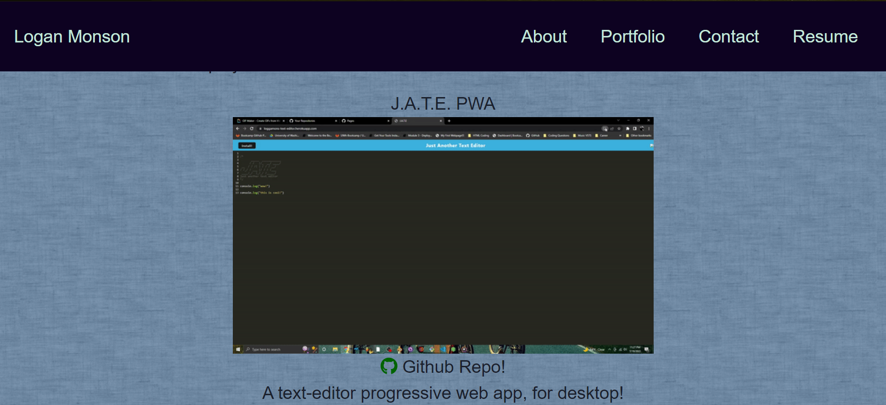
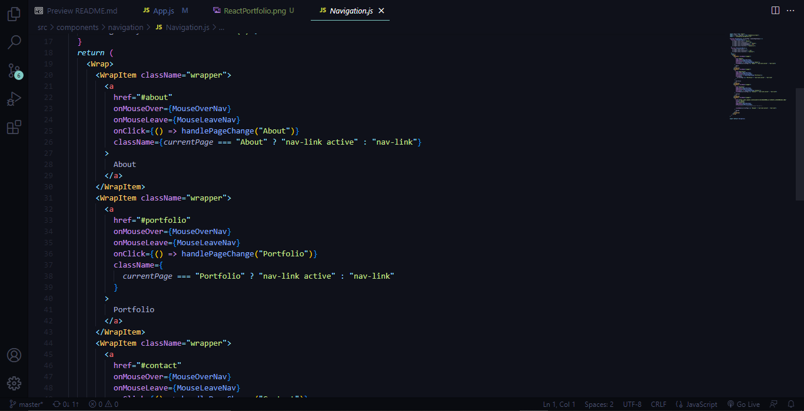

# Logan's React Portfolio  




## Description

Why did you decide to build this project?

````
Now that I have practiced writing React applications, I wanted to update my portfolio with React components so I can show off my capabilities to future employers!
````

## Table of Contents

- [Installation](#installation)
- [Usage](#usage)
- [Contributing](#contributing)
- [Tests](#tests)
- [Questions](#questions)

## Installation

How to install:

````
In order to install this project, they would simply need to install the SSN code from the git repository at the root of their new directory in their local machine!
````

## Usage

How does your project work?

````
My portfolio is powered by React; a system that allows the webpage to refresh modularly; rather than having the browser update the entire page for every change/query made, React allows the DOM to upate itslf in smaller chunks, allowing to faster responses and load-times.
````

## Contributing

How can you contribute to this project?

````
The Portfolio has a 'contact' page! If you have any thoughts or critiques about the code, feel free to write them there!
````

## Tests

To run this program:

````
I have a function that allows hover elements to occur depending on what element you cursor over:

function MouseOver(e) {
    if (e.target.id === "github") {
      e.target.style.color = appColors.github;
      e.target.style.transition = ".3s";
      e.target.style.transform = "scale(1.2)";
    } else if (e.target.id === "linkedIn") {
      e.target.style.color = appColors.linkedin;
      e.target.style.transition = ".3s";
      e.target.style.transform = "scale(1.2)";
    } else if (e.target.id === "youtube") {
      e.target.style.color = appColors.youtube;
      e.target.style.transition = ".3s";
      e.target.style.transform = "scale(1.2)";
    }
  }
  function MouseLeave(e) {
    e.target.style.color = "";
    e.target.style.transition = ".2s";
    e.target.style.transform = "scale(1)";
  }

Since React doesn't like 'hover' styles in-line, I had to resort to 'mouseOver' and 'mouseLeave' methods!
````

Youn access the application [here!](https://loggamon.github.io/my-react-portfolio/)

## Questions

If you have any questions, you can contact me through:

- [Github](https://github.com/Loggamon)
- Email: scarletfedora@gmail.com

## License & Copyright

© Logan Monson